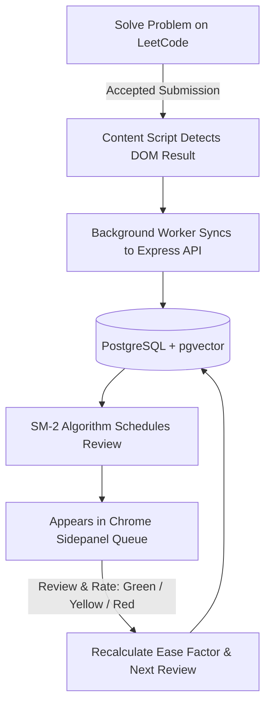

# LeetCoach 🚀

> **AI-Powered Spaced Repetition & Active Recall System for LeetCode Mastery.**

LeetCoach is a modern full-stack browser extension and platform designed to eliminate the "forgetting curve" for Data Structures & Algorithms (DSA). By capturing your accepted LeetCode submissions in real time, LeetCoach schedules intelligent review intervals using the **SuperMemo-2 (SM-2)** algorithm and provides a unified interface for code review, mistake logging, and AI-powered memory retentions.

---

## 🌟 Key Features

- **Automated Submission Sync**: Real-time DOM observation captures accepted LeetCode solutions, language, runtime metadata, and problem tags automatically.
- **SM-2 Spaced Repetition Engine**: Calculates optimal review intervals (1 day, 6 days, 16 days, etc.) based on active recall difficulty ratings (Green, Yellow, Red).
- **Chrome Extension Sidepanel**: Modern, dark-mode React UI built into Chrome's side panel for frictionless review without leaving LeetCode.
- **RAG & Vector Search Ready**: Integrated PostgreSQL + `pgvector` backend schema designed for semantic search across past solutions and mistake patterns.
- **Offline Sync Queue**: Keeps local backups in Chrome storage if unauthenticated or offline, auto-flushing to the cloud upon connection.
- **Monorepo Architecture**: Clean separation of backend services, Chrome extension, and shared type definitions.

---

## 🛠️ Tech Stack

### Frontend & Extension
- **Framework**: React 18 + TypeScript
- **Styling**: TailwindCSS + Lucide Icons
- **Bundler**: Vite + Rollup
- **Extension API**: Chrome Extension Manifest V3 (Side Panel, Service Workers, MAIN World content scripts)

### Backend & Database
- **Runtime**: Node.js + Express
- **Database**: PostgreSQL 16 with `pgvector`
- **ORM**: Drizzle ORM
- **Authentication**: JWT (JSON Web Tokens) with bcrypt password hashing
- **Containerization**: Docker Compose

---

## 📁 Repository Structure

```
LeetCoach/
├── apps/
│   ├── backend/          # Express API server, Drizzle ORM schema, SM-2 engine
│   └── extension/        # Chrome Extension (Sidepanel React UI, Content Scripts, Background)
├── packages/
│   └── shared/           # Shared TypeScript types, interfaces, and SM-2 constants
├── docker-compose.yml    # PostgreSQL + pgvector database container
├── .env.example          # Environment configuration template
└── package.json          # Monorepo workspace configuration
```

---

## 🚀 Getting Started

### Prerequisites

- **Node.js**: `v18.x` or `v20.x`
- **npm**: `v9.x` or higher
- **Docker Desktop** (or PostgreSQL with `pgvector` installed)
- **Google Chrome** (v114+ for Side Panel API support)

---

### Installation & Setup

1. **Clone the repository**:
   ```bash
   git clone https://github.com/YOUR_USERNAME/LeetCoach.git
   cd LeetCoach
   ```

2. **Install workspace dependencies**:
   ```bash
   npm install
   ```

3. **Configure environment variables**:
   ```bash
   cp .env.example .env
   ```

4. **Start PostgreSQL database with `pgvector`**:
   ```bash
   docker compose up -d
   ```

5. **Push database schema**:
   ```bash
   npm run db:push --workspace=apps/backend
   ```

6. **Start the backend development server**:
   ```bash
   npm run dev:backend
   ```
   *The backend will start on `http://localhost:3000`.*

7. **Build the Chrome Extension**:
   In a new terminal window, run:
   ```bash
   npm run build:extension
   ```

---

### Loading the Extension in Google Chrome

1. Open Google Chrome and navigate to `chrome://extensions/`.
2. Toggle on **Developer mode** in the top right corner.
3. Click **Load unpacked** (top left).
4. Select the directory: `LeetCoach/apps/extension/dist`.
5. Open any LeetCode problem (e.g., [Two Sum](https://leetcode.com/problems/two-sum/)).
6. Click the **LeetCoach** icon to open the sidepanel, register an account, and start solving!

---

## 🔄 Spaced Repetition Workflow



---

## 💻 Commands Quick Reference

| Command | Description |
| :--- | :--- |
| `npm run dev:backend` | Starts backend API with live reload |
| `npm run build:extension` | Compiles TypeScript & bundles Chrome Extension into `dist/` |
| `npm run db:push` | Syncs Drizzle ORM schema to PostgreSQL database |
| `docker compose up -d` | Launches PostgreSQL container with `pgvector` |
| `docker compose down` | Stops database container |

---

## 🛡️ License

Distributed under the MIT License. See `LICENSE` for more information.
