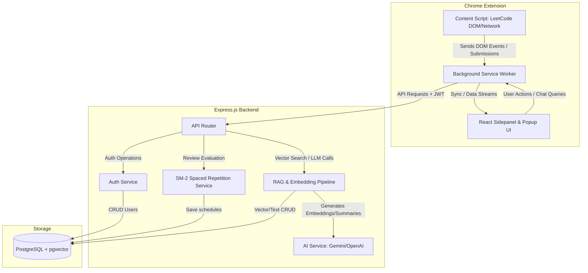
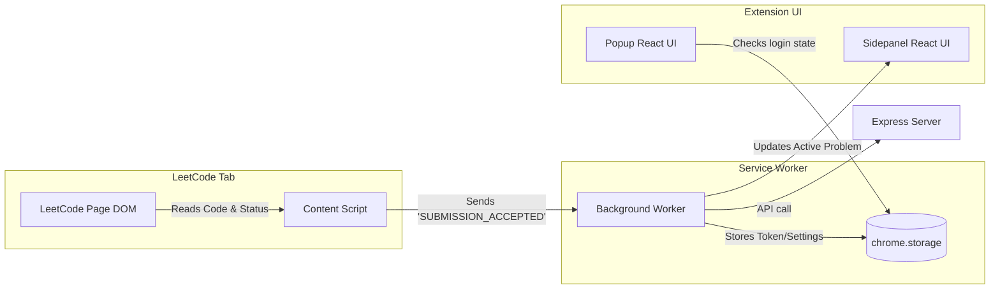
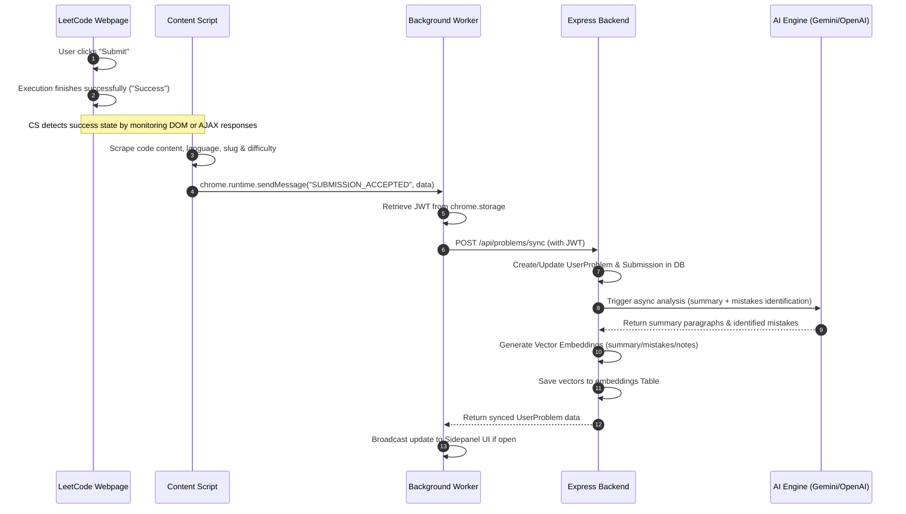
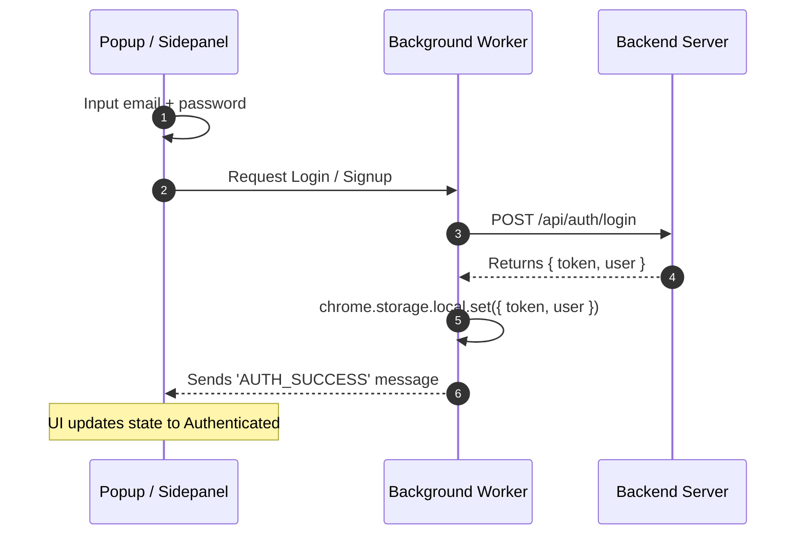
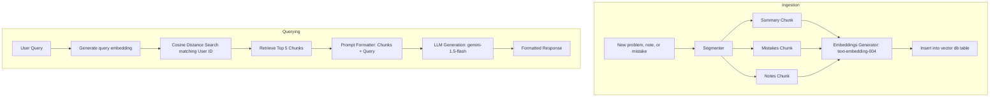
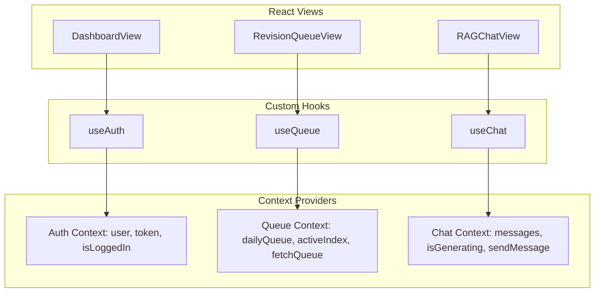

# LeetCoach: Technical Design Document

This document serves as the master blueprint and system architecture design for **LeetCoach**, an AI-powered personal learning system for LeetCode. It implements adaptive spaced repetition and Retrieval-Augmented Generation (RAG) to help developers retain solved problems.

---

## 1. Overall Architecture

LeetCoach is designed as a modular monorepo consisting of three main areas:
1. **Frontend (Chrome Extension)**: Captures user activity, manages local settings, and renders a rich React UI in the popup and sidepanel.
2. **Backend Services (Node.js & Express.js)**: Orchestrates business logic, manages authentication, serves API requests, and executes database queries.
3. **Database (PostgreSQL + pgvector)**: Stores relational data, tracking history, and high-dimensional vector embeddings for semantic search and RAG.



---

## 2. Monorepo Folder Structure

A monorepo structure using npm/pnpm workspaces provides a clean separation of concerns while allowing TypeScript types to be shared between backend and extension packages.

```
leetcoach-monorepo/
├── package.json
├── tsconfig.json
├── apps/
│   ├── backend/                 # Node.js + Express.js + Drizzle
│   │   ├── src/
│   │   │   ├── config/          # Environment, database, AI connections
│   │   │   ├── controllers/     # Route request handlers
│   │   │   ├── db/              # Drizzle ORM client, schemas, migrations
│   │   │   │   ├── index.ts
│   │   │   │   └── schema.ts
│   │   │   ├── middleware/      # Auth validator, error handlers, rate-limiters
│   │   │   ├── routes/          # Express route definitions
│   │   │   ├── services/        # SM-2, RAG pipeline, AI wrapper
│   │   │   │   ├── ai.service.ts
│   │   │   │   ├── rag.service.ts
│   │   │   │   └── sm2.service.ts
│   │   │   ├── index.ts         # Server entry point
│   │   │   └── types.ts
│   │   ├── tsconfig.json
│   │   └── package.json
│   │
│   └── extension/               # React + TS + Tailwind + Vite
│       ├── manifest.json        # Extension Manifest V3 configuration
│       ├── vite.config.ts
│       ├── tailwind.config.js
│       ├── src/
│       │   ├── background/      # Service worker handling storage, sync, messaging
│       │   │   └── index.ts
│       │   ├── content/         # Injected scripts monitoring LeetCode status
│       │   │   └── index.ts
│       │   ├── popup/           # Small overlay popup for quick actions/status
│       │   │   ├── index.html
│       │   │   └── main.tsx
│       │   ├── sidepanel/       # Main learning interface & chat panel
│       │   │   ├── index.html
│       │   │   ├── main.tsx
│       │   │   ├── components/  # Feature-specific UI components
│       │   │   │   ├── common/  # Buttons, inputs, modals
│       │   │   │   ├── revision/
│       │   │   │   ├── dashboard/
│       │   │   │   └── chat/
│       │   │   ├── hooks/       # Custom React hooks (useAuth, useQueue, etc.)
│       │   │   ├── context/     # React context providers
│       │   │   └── styles/
│       │   └── types/
│       └── package.json
│
└── packages/
    └── shared/                  # Shared TypeScript models and utility functions
        ├── index.ts
        ├── src/
        │   ├── types/           # Spaced Repetition, Problem, and User models
        │   └── utils/
        └── package.json
```

---

## 3. Database Schema (Drizzle ORM)

Using PostgreSQL with `pgvector` allows relational tables and semantic embeddings to sit in the same database, ensuring consistent transactional behavior and unified queries.

```typescript
import { 
  pgTable, 
  uuid, 
  varchar, 
  text, 
  integer, 
  timestamp, 
  doublePrecision, 
  vector, 
  index, 
  unique 
} from 'drizzle-orm/pg-core';
import { relations } from 'drizzle-orm';

// 1. Users Table
export const users = pgTable('users', {
  id: uuid('id').defaultRandom().primaryKey(),
  email: varchar('email', { length: 255 }).notNull().unique(),
  passwordHash: varchar('password_hash', { length: 255 }).notNull(),
  createdAt: timestamp('created_at').defaultNow().notNull(),
  updatedAt: timestamp('updated_at').defaultNow().notNull(),
});

// 2. Global Problems Cache (Avoids redundant metadata storage)
export const problems = pgTable('problems', {
  id: uuid('id').defaultRandom().primaryKey(),
  leetcodeId: integer('leetcode_id').notNull().unique(),
  title: varchar('title', { length: 255 }).notNull(),
  titleSlug: varchar('title_slug', { length: 255 }).notNull().unique(),
  difficulty: varchar('difficulty', { length: 20 }).notNull(), // Easy, Medium, Hard
  url: varchar('url', { length: 512 }).notNull(),
  topicTags: text('topic_tags').array().notNull(), // e.g. ['Array', 'Hash Table']
  createdAt: timestamp('created_at').defaultNow().notNull(),
});

// 3. User-Problem Join Table (Stores mastery state & revision scheduling)
export const userProblems = pgTable('user_problems', {
  id: uuid('id').defaultRandom().primaryKey(),
  userId: uuid('user_id').references(() => users.id, { onDelete: 'cascade' }).notNull(),
  problemId: uuid('problem_id').references(() => problems.id, { onDelete: 'cascade' }).notNull(),
  
  // Spaced Repetition Variables (SM-2)
  masteryLevel: integer('mastery_level').default(0).notNull(), // Repetition count
  easeFactor: doublePrecision('ease_factor').default(2.5).notNull(), // Ease Factor (starts at 2.5)
  reviewCount: integer('review_count').default(0).notNull(),
  lastReviewed: timestamp('last_reviewed'),
  nextReview: timestamp('next_review').defaultNow().notNull(),
  lastRating: varchar('last_rating', { length: 20 }), // Green, Yellow, Red
  
  // Custom Notes and AI Summaries
  notes: text('notes').default(''),
  aiSummary: text('ai_summary'),
  
  createdAt: timestamp('created_at').defaultNow().notNull(),
  updatedAt: timestamp('updated_at').defaultNow().notNull(),
}, (t) => ({
  userProblemUnique: unique().on(t.userId, t.problemId),
  nextReviewIdx: index('next_review_idx').on(t.nextReview),
}));

// 4. Code Submissions History
export const codeSubmissions = pgTable('code_submissions', {
  id: uuid('id').defaultRandom().primaryKey(),
  userProblemId: uuid('user_problem_id').references(() => userProblems.id, { onDelete: 'cascade' }).notNull(),
  code: text('code').notNull(),
  language: varchar('language', { length: 50 }).notNull(),
  status: varchar('status', { length: 50 }).notNull(), // Accepted, Wrong Answer, etc.
  submittedAt: timestamp('submitted_at').defaultNow().notNull(),
});

// 5. Mistake Logs
export const mistakes = pgTable('mistakes', {
  id: uuid('id').defaultRandom().primaryKey(),
  userProblemId: uuid('user_problem_id').references(() => userProblems.id, { onDelete: 'cascade' }).notNull(),
  description: text('description').notNull(),
  category: varchar('category', { length: 100 }).notNull(), // e.g. "Edge Case", "Time Limit Exceeded", "Logic Bug"
  preventionPlan: text('prevention_plan').notNull(),
  createdAt: timestamp('created_at').defaultNow().notNull(),
});

// 6. Detailed Review Logs (For historical analytics / streaks)
export const reviewLogs = pgTable('review_logs', {
  id: uuid('id').defaultRandom().primaryKey(),
  userProblemId: uuid('user_problem_id').references(() => userProblems.id, { onDelete: 'cascade' }).notNull(),
  ratedAt: timestamp('rated_at').defaultNow().notNull(),
  rating: varchar('rating', { length: 20 }).notNull(), // Green, Yellow, Red
  easeFactor: doublePrecision('ease_factor').notNull(),
  intervalDays: integer('interval_days').notNull(),
  reviewDurationSeconds: integer('review_duration_seconds'), // Optional metric tracking speed
});

// 7. Vector Embeddings Table for RAG (Dual support: 1536 OpenAI or 768 Gemini)
export const embeddings = pgTable('embeddings', {
  id: uuid('id').defaultRandom().primaryKey(),
  userProblemId: uuid('user_problem_id').references(() => userProblems.id, { onDelete: 'cascade' }).notNull(),
  chunkType: varchar('chunk_type', { length: 50 }).notNull(), // 'summary', 'mistake', 'notes', 'code'
  contentChunk: text('content_chunk').notNull(),
  
  // pgvector column setup. Using 768 dimensions for Gemini text-embedding-004 by default.
  // Can be configured to 1536 if text-embedding-3-small is selected instead.
  embedding: vector('embedding', { dimensions: 768 }).notNull(),
  createdAt: timestamp('created_at').defaultNow().notNull(),
}, (t) => ({
  // HNSW index is highly optimized for cosine distance search
  embeddingIdx: index('embedding_hnsw_idx').using('hnsw', t.embedding.op('vector_cosine_ops')),
}));

// Schema Relations Definition
export const usersRelations = relations(users, ({ many }) => ({
  userProblems: many(userProblems),
}));

export const problemsRelations = relations(problems, ({ many }) => ({
  userProblems: many(userProblems),
}));

export const userProblemsRelations = relations(userProblems, ({ one, many }) => ({
  user: one(users, { fields: [userProblems.userId], references: [users.id] }),
  problem: one(problems, { fields: [userProblems.problemId], references: [problems.id] }),
  submissions: many(codeSubmissions),
  mistakes: many(mistakes),
  reviewLogs: many(reviewLogs),
  embeddings: many(embeddings),
}));
```

---

## 4. API Design

All endpoints require JWT authorization passed in the `Authorization: Bearer <JWT>` header except for public authentication endpoints.

### Authentication Endpoints
- **POST** `/api/auth/register`
  - Body: `{ email, password }`
  - Response: `201 Created` `{ token, user: { id, email } }`
- **POST** `/api/auth/login`
  - Body: `{ email, password }`
  - Response: `200 OK` `{ token, user: { id, email } }`
- **GET** `/api/auth/me`
  - Response: `200 OK` `{ user: { id, email } }`

### Problems & Tracking
- **POST** `/api/problems/sync`
  - Body: 
    ```json
    {
      "leetcodeId": 1,
      "title": "Two Sum",
      "titleSlug": "two-sum",
      "difficulty": "Easy",
      "url": "https://leetcode.com/problems/two-sum/",
      "topicTags": ["Array", "Hash Table"],
      "code": "function twoSum(nums, target)...",
      "language": "javascript",
      "status": "Accepted"
    }
    ```
  - Response: `200 OK` or `201 Created` returning the user-problem record with an AI generated summary queue identifier.

### Spaced Repetition & Revision Queue
- **GET** `/api/problems/queue`
  - Query Parameters: `?limit=10`
  - Response: `200 OK` 
    ```json
    {
      "queue": [
        {
          "id": "uuid-user-problem",
          "nextReview": "2026-07-16T10:00:00Z",
          "masteryLevel": 3,
          "problem": {
            "title": "Two Sum",
            "difficulty": "Easy",
            "topicTags": ["Array"]
          }
        }
      ]
    }
    ```
- **POST** `/api/problems/:userProblemId/review`
  - Body: `{ rating: "Green" | "Yellow" | "Red", durationSeconds?: number }`
  - Response: `200 OK` returning updated SM-2 parameters (`nextReview`, `easeFactor`, `masteryLevel`).

### Problem Notes & Mistakes Management
- **PATCH** `/api/problems/:userProblemId/notes`
  - Body: `{ notes: "My custom solution notes..." }`
  - Response: `200 OK` (triggers background embedding rebuild).
- **POST** `/api/problems/:userProblemId/mistakes`
  - Body: `{ description: "Failed to handle negative numbers", category: "Edge Case", preventionPlan: "Add initial assertions" }`
  - Response: `201 Created`.
- **DELETE** `/api/problems/:userProblemId/mistakes/:mistakeId`
  - Response: `200 OK`.

### RAG and Semantic Search
- **POST** `/api/chat`
  - Body: `{ message: "Explain my common mistakes in Tree problems", conversationHistory: [...] }`
  - Response (Streams SSE/JSON): `{ answer: "Based on your notes, you often forget the null check on root..." }`
- **GET** `/api/problems/search`
  - Query Parameters: `?q=binary search index out of bounds`
  - Response: `200 OK` returning an array of matched user problems ranked by semantic similarity.

### Analytics & Insights
- **GET** `/api/analytics/dashboard`
  - Response: `200 OK`
    ```json
    {
      "streak": 5,
      "totalSolved": 142,
      "masteryDistribution": { "Easy": 0.85, "Medium": 0.42, "Hard": 0.12 },
      "topicMastery": [ { "topic": "Dynamic Programming", "mastery": 0.35 } ],
      "heatmap": { "2026-07-14": 3, "2026-07-15": 5 }
    }
    ```

---

## 5. Extension Architecture (Manifest V3)

The extension comprises background services, injected scripts, and React panels running in different execution environments.



### Manifest V3 Configuration (`manifest.json`)
```json
{
  "manifest_version": 3,
  "name": "LeetCoach",
  "version": "1.0.0",
  "description": "AI-powered spaced repetition system for LeetCode mastery.",
  "permissions": [
    "storage",
    "activeTab",
    "sidePanel",
    "declarativeNetRequest"
  ],
  "host_permissions": [
    "https://leetcode.com/*",
    "https://api.leetcoach.dev/*" 
  ],
  "background": {
    "service_worker": "background.js",
    "type": "module"
  },
  "content_scripts": [
    {
      "matches": ["https://leetcode.com/problems/*"],
      "js": ["content.js"],
      "run_at": "document_idle"
    }
  ],
  "side_panel": {
    "default_path": "sidepanel.html"
  },
  "action": {
    "default_popup": "popup.html"
  }
}
```

---

## 6. Message Flow Diagram

### Scenario A: Automatic Capture on Successful Submission


---

## 7. Authentication Flow

Authentication is JWT-based, managed securely through the background worker.



*To protect against Session Hijacking and XSS:*
- Tokens are stored using Chrome's isolated `chrome.storage.local` API, making them immune to script injection from standard pages.
- Background Script acts as a proxy for all HTTP requests to the Backend, appending the `Authorization` header automatically.

---

## 8. RAG Pipeline

Retrieval-Augmented Generation context builds a dynamic learning loop. Users can chat directly with their historical learning data.



### Context Formatting Protocol
To avoid context limits and maximize LLM performance, retrieved segments are formatted cleanly:
```markdown
[Context 1: Two Sum (Easy)]
Summary: Finds indices of two numbers that add up to target using a Map.
User Note: Edge cases are array length 2. Be careful of indexing.
Mistakes: Forgot to return empty array when no solution exists.

[Context 2: ... ]
---
User Query: Tell me what I struggle with most in Array problems.
```

---

## 9. Adaptive Spaced Repetition Algorithm

Standard SM-2 relies on static card values. For programming questions, we refine the scale. Recall rating translates into interval adjustments using the following updated metrics:

### Recall Quality Ratings:
- 🟢 **Green (Confidently remembered)**: Quality $q = 5$
- 🟡 **Yellow (Remembered with effort)**: Quality $q = 3$
- 🔴 **Red (Forgot / could not write)**: Quality $q = 1$

### Mathematical Progression:
1. **Ease Factor Update ($EF'$)**:
   $$EF' = \max\left(1.3, \ EF + \left(0.1 - (5 - q) \times \left(0.08 + (5 - q) \times 0.02\right)\right)\right)$$

2. **Repetition Count ($n$) and Next Interval ($I$ in days) Update**:
   - If quality is Red ($q < 3$):
     - Reset repetition count $n = 0$
     - Set next interval $I = 1$ day (review tomorrow)
   - If quality is Yellow or Green ($q \ge 3$):
     - If $n = 0$: $I = 1$ day
     - If $n = 1$: $I = 3$ days (adjusted upward from SM-2's 6 days to prevent forgetting coding patterns too quickly)
     - If $n \ge 2$: $I = \text{round}(I_{\text{previous}} \times EF')$
     - Increment $n$ by $1$ ($n' = n + 1$)

3. **Difficulty Modifiers**:
   - Hard problems scale intervals down by 20% to increase frequency:
     $$I_{\text{final}} = \text{round}(I \times 0.8)$$
   - Easy problems scale intervals up by 20% to decrease frequency:
     $$I_{\text{final}} = \text{round}(I \times 1.2)$$

### TS Implementation Blueprint
```typescript
interface ReviewParams {
  rating: 'Green' | 'Yellow' | 'Red';
  difficulty: 'Easy' | 'Medium' | 'Hard';
  currentEaseFactor: number;
  currentRepetition: number;
  currentIntervalDays: number;
}

export function calculateNextReview(params: ReviewParams) {
  const { rating, difficulty, currentEaseFactor, currentRepetition, currentIntervalDays } = params;
  
  // Map rating to Quality value
  const q = rating === 'Green' ? 5 : rating === 'Yellow' ? 3 : 1;
  
  // Calculate new Ease Factor (EF')
  let easeFactor = currentEaseFactor + (0.1 - (5 - q) * (0.08 + (5 - q) * 0.02));
  if (easeFactor < 1.3) easeFactor = 1.3;
  
  let nextRepetition = currentRepetition;
  let nextIntervalDays = 1;

  if (q < 3) {
    // Forgot target problem
    nextRepetition = 0;
    nextIntervalDays = 1;
  } else {
    // Correct recall
    if (currentRepetition === 0) {
      nextIntervalDays = 1;
    } else if (currentRepetition === 1) {
      nextIntervalDays = 3; // Custom 3 days instead of SM2's 6 days for code patterns
    } else {
      nextIntervalDays = Math.round(currentIntervalDays * easeFactor);
    }
    nextRepetition += 1;
  }

  // Adjust intervals dynamically based on difficulty
  if (difficulty === 'Hard') {
    nextIntervalDays = Math.max(1, Math.round(nextIntervalDays * 0.8));
  } else if (difficulty === 'Easy') {
    nextIntervalDays = Math.max(1, Math.round(nextIntervalDays * 1.2));
  }

  const nextReview = new Date();
  nextReview.setDate(nextReview.getDate() + nextIntervalDays);

  return {
    easeFactor,
    repetition: nextRepetition,
    intervalDays: nextIntervalDays,
    nextReview,
  };
}
```

---

## 10. Component Hierarchy (Sidepanel React UI)

The extension UI is managed inside a multi-view sidepanel.

```
SidepanelRoot (App)
├── AuthGuard (Validates tokens; redirects if unauthenticated)
│   ├── Login/Signup View
│   └── Main Layout (Sidebar + Content view)
│       ├── Header (Daily streak indicator + Current user profile)
│       ├── NavigationTabs (Dashboard | Revision Queue | RAG Chat | Settings)
│       │
│       ├── DashboardView
│       │   ├── StatsGrid (Total Solved, Mastery Percentage, Overdue reviews count)
│       │   ├── ContributionHeatmap (GitHub style)
│       │   └── TopicMasteryBreakdown (Progress bars color-coded by performance)
│       │
│       ├── RevisionQueueView
│       │   ├── QueueSummary (e.g. "3 problems remaining today")
│       │   └── ActiveReviewCard (Shows currently scheduled problem details)
│       │       ├── CardHeader (Title, Difficulty tag, Last rating indicator)
│       │       ├── RevealArea (Hidden by default; reveals summary & user notes)
│       │       ├── CodeViewer (Syntax highlighted original code)
│       │       └── ActionButtons (Green/Yellow/Red scoring buttons)
│       │
│       ├── RAGChatView
│       │   ├── ChatMessageHistory (System status messages & human/AI text bubbles)
│       │   ├── ContextReferencesList (Sourced problems used to construct the answer)
│       │   └── ChatInputForm (Multi-line prompt text box + Submit button)
│       │
│       └── SettingsView
│           ├── ModelSelector (Configures Gemini-1.5-Pro / Gemini-1.5-Flash / GPT-4o)
│           ├── ClearDataButton (Clears extension storage)
│           └── LogoutButton
```

---

## 11. State Management Approach

To keep the application highly responsive and lightweight without adding heavy dependencies like Redux, we use **React Context** paired with specialized custom hooks.



---

## 12. Security Considerations

1. **API Origin Restrictions (CORS & Extension Manifest)**:
   The backend API will strictly whitelist requests coming from the unique Chrome extension origin (`chrome-extension://<EXTENSION_ID>`).
2. **Content Security Policy (CSP)**:
   The Extension UI enforces strict CSP rules to prevent execution of remotely hosted code. All scripts must be bundled locally within the extension.
3. **Data Protection & Storage**:
   JWT tokens are stored using Chrome’s isolated `chrome.storage.local` API, rendering them immune to script injection from standard pages.
4. **AI Prompt Isolation**:
   To prevent prompt injection, LLM generation routines use structured output validation and system guidelines that reject overrides instructing the model to leak system configurations.

---

## 13. Development Roadmap

```
Milestone 1: Core Extension & Scraper
  │── Setup Monorepo and Dev tooling
  │── Write content-scripts to detect successful LeetCode submissions
  └── Store scraped solutions in chrome.storage
                                │
Milestone 2: Backend foundation & Auth
  │── Build Express.js server boilerplate
  │── Define PostgreSQL schema via Drizzle ORM
  └── JWT auth API and integration in extension background
                                │
Milestone 3: Spaced Repetition Core
  │── Implement SM-2 algorithm service
  │── Revision Queue & Review Rating API endpoints
  └── Build Extension Sidepanel & ActiveReviewCard components
                                │
Milestone 4: AI & pgvector Embeddings
  │── Add Gemini/OpenAI API integrations
  │── Implement AI summarization and mistake categorization workers
  └── Setup pgvector table and index for high-speed similarity search
                                │
Milestone 5: RAG & Chat Service
  │── Write similarity search retrievers
  │── Build complete RAG query interface (Chat Panel)
  └── Implement Server-Sent Events (SSE) for streaming AI responses
                                │
Milestone 6: Analytics & Polishing
    ├── Build Heatmap component & Topic mastery visualizations
    ├── UI styling refinement & performance audit
    └── Compile Chrome Extension bundle for distribution
```
